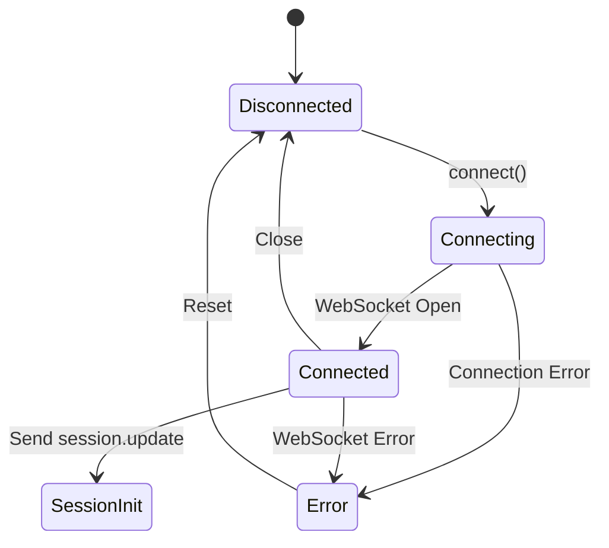
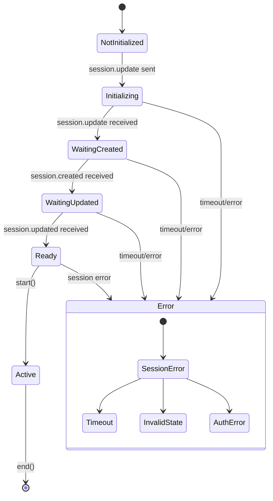
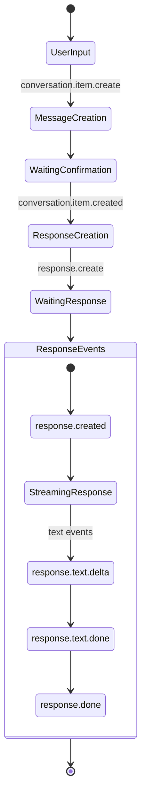
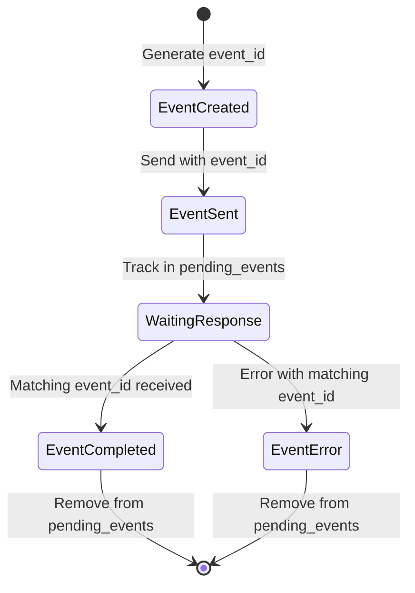

# OpenAI Realtime API State Machine

## 1. Connection States


## 2. Session States


## 3. Message Flow


## 4. Event Correlation


## 5. Required Events and Their States

### Client Events
1. `session.update`
   - States: `PENDING`, `CONFIRMED`, `ERROR`
   - Required Fields:
     ```python
     {
         "type": "session.update",
         "event_id": str,
         "session": {
             "instructions": str,
             "modalities": ["text"],
             "tools": list,
             "tool_choice": str
         }
     }
     ```

2. `conversation.item.create`
   - States: `PENDING`, `CONFIRMED`, `ERROR`
   - Required Fields:
     ```python
     {
         "type": "conversation.item.create",
         "event_id": str,
         "item": {
             "type": "message",
             "role": "user",
             "content": [
                 {
                     "type": "input_text",
                     "text": str
                 }
             ]
         }
     }
     ```

3. `response.create`
   - States: `PENDING`, `STREAMING`, `COMPLETED`, `ERROR`
   - Required Fields:
     ```python
     {
         "type": "response.create",
         "event_id": str,
         "response": {
             "modalities": ["text"]
         }
     }
     ```

### Server Events
1. `session.created`
   - Data:
     ```python
     {
         "type": "session.created",
         "event_id": str,
         "session": {
             "id": str,
             "object": "realtime.session",
             "model": str,
             "expires_at": int
         }
     }
     ```

2. `session.updated`
   - Data:
     ```python
     {
         "type": "session.updated",
         "event_id": str,
         "session": {
             "id": str,
             "instructions": str,
             "modalities": ["text"]
         }
     }
     ```

3. Response Events Sequence:
   ```python
   [
       {"type": "response.created", "event_id": str},
       {"type": "response.text.delta", "event_id": str, "delta": str},
       {"type": "response.text.done", "event_id": str},
       {"type": "response.done", "event_id": str, "response": {...}}
   ]
   ```

## 6. Error States and Recovery

### Error Types
1. Connection Errors
   - WebSocket connection failed
   - Authentication failed
   - Network timeout

2. Session Errors
   - Session initialization failed
   - Session expired
   - Invalid session state

3. Message Errors
   - Invalid message format
   - Message delivery failed
   - Response timeout

### Recovery Paths
1. Connection Recovery
   ```mermaid
   stateDiagram-v2
       [*] --> Error
       Error --> Backoff: Start backoff timer
       Backoff --> Reconnecting: Attempt reconnect
       Reconnecting --> Connected: Success
       Reconnecting --> Backoff: Failure
       Connected --> [*]
   ```

2. Session Recovery
   ```mermaid
   stateDiagram-v2
       [*] --> SessionError
       SessionError --> ValidateState: Check current state
       ValidateState --> ReinitSession: State invalid
       ValidateState --> ResumeSession: State valid
       ReinitSession --> [*]: New session
       ResumeSession --> [*]: Continue
   ```

## 7. Timeouts and Retry Specifications

### Connection Timeouts
```python
TIMEOUTS = {
    'connection': 30,  # Initial connection timeout (seconds)
    'session_init': 10,  # Session initialization timeout
    'message_response': 15,  # Wait for message confirmation
    'response_stream': 60,  # Maximum time to wait for complete response
    'reconnect_attempt': 5,  # Single reconnection attempt
}

RETRY_LIMITS = {
    'connection': 3,  # Maximum connection retry attempts
    'session_init': 2,  # Session initialization retries
    'message_send': 2,  # Message send retries
}

BACKOFF_STRATEGY = {
    'initial_delay': 1,  # seconds
    'max_delay': 32,  # seconds
    'multiplier': 2,  # exponential backoff multiplier
    'jitter': 0.1,  # random jitter factor
}
```

## 8. State Transition Guards

### Connection Guards
```python
def can_connect(state):
    return (
        state.current == 'Disconnected' and
        not state.in_backoff and
        state.retry_count < RETRY_LIMITS['connection']
    )

def can_initialize_session(state):
    return (
        state.current == 'Connected' and
        not state.session_id and
        state.retry_count < RETRY_LIMITS['session_init']
    )
```

### Message Guards
```python
def can_send_message(state):
    return (
        state.session_state == 'Ready' and
        not state.pending_response and
        len(state.pending_events) < MAX_PENDING_EVENTS
    )

def can_create_response(state):
    return (
        state.message_confirmed and
        not state.response_streaming
    )
```

## 9. Cleanup Procedures

### Session Cleanup
```python
def cleanup_session():
    """
    Cleanup sequence when ending a session:
    1. Cancel all pending events
    2. Clear message queue
    3. Reset state trackers
    4. Close WebSocket connection
    5. Clear session ID
    """
    steps = [
        'cancel_pending_events',
        'clear_message_queue',
        'reset_state_trackers',
        'close_connection',
        'clear_session_id'
    ]
```

### Event Cleanup
```python
def cleanup_events():
    """
    Event cleanup process:
    1. Remove expired events
    2. Cancel unconfirmed events
    3. Clear response buffers
    4. Reset correlation IDs
    """
    steps = [
        'remove_expired_events',
        'cancel_unconfirmed',
        'clear_buffers',
        'reset_correlation'
    ]
```

## 10. Validation Rules

### Event Validation
```python
EVENT_VALIDATION = {
    'session.update': {
        'required_fields': ['type', 'session'],
        'session_fields': ['instructions', 'modalities'],
        'state_requirements': ['Connected', 'NotInitialized']
    },
    'conversation.item.create': {
        'required_fields': ['type', 'item'],
        'item_fields': ['type', 'role', 'content'],
        'state_requirements': ['Ready', 'Active']
    }
}
```

### State Validation
```python
STATE_VALIDATION = {
    'Connected': {
        'prerequisites': ['websocket_connected', 'auth_valid'],
        'invariants': ['session_id == None', 'pending_events == {}']
    },
    'Ready': {
        'prerequisites': ['session_created', 'session_updated'],
        'invariants': ['session_id != None', 'session_expires_at > now()']
    }
} 